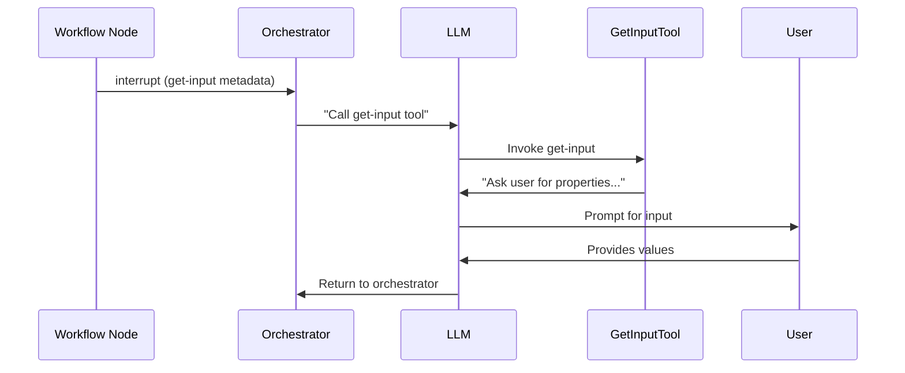
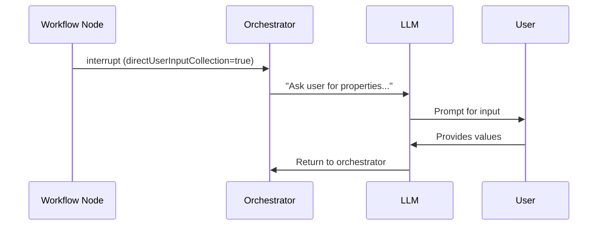

# Orchestrator Input Collection Optimization

## Overview

This document describes two optimizations to the MCP workflow orchestrator that improve latency, clarity, and LLM interaction reliability.

## Changes

### 1. Direct User Input Collection

**Problem**: The original workflow required an intermediate tool call when collecting user input:

```
GetUserInputNode → interrupt → Orchestrator → LLM calls get-input tool → Tool returns prompt → LLM gathers input → Returns to Orchestrator
```

This added:
- One extra tool call round-trip (~2-5 seconds latency)
- Additional LLM context switching between tools
- More opportunities for LLM misinterpretation

**Solution**: Added `directUserInputCollection` flag to `MCPToolInvocationData` that signals the orchestrator to generate the user input collection prompt directly.

```
GetUserInputNode → interrupt (with flag) → Orchestrator generates prompt directly → LLM gathers input → Returns to Orchestrator
```

**Implementation**:

```typescript
// MCPToolInvocationData now includes:
interface MCPToolInvocationData<T> {
  llmMetadata: { ... };
  input: { ... };
  directUserInputCollection?: boolean; // New flag
}
```

When `GetInputService` creates an interrupt, it sets `directUserInputCollection: true`. The orchestrator detects this flag and generates the user input prompt inline, eliminating the intermediate tool call.

**Benefits**:
- **Reduced latency**: Eliminates one tool call round-trip
- **Simpler flow**: Fewer steps mean fewer opportunities for errors
- **Consistent behavior**: Same result schema (`{ userUtterance: ... }`) preserved

### 2. Structured Initial Request Schema

**Problem**: The orchestrator's `userInput` parameter accepted any object structure, making it unclear to LLMs what format to use when starting a new workflow versus resuming one.

**Solution**: Defined explicit schemas for different call types:

```typescript
// For initial workflow calls
export const INITIAL_USER_REQUEST_SCHEMA = z.object({
  request: z.string().describe("The user's initial request to start the workflow"),
});

// For resumption calls (flexible)
export const RESUMPTION_USER_INPUT_SCHEMA = z.record(z.string(), z.unknown());

// Combined schema
export const USER_INPUT_SCHEMA = z.union([
  INITIAL_USER_REQUEST_SCHEMA,
  RESUMPTION_USER_INPUT_SCHEMA,
]);
```

**Benefits**:
- **Clear contract**: LLMs know exactly what format to use for initial calls
- **Better documentation**: Schema descriptions guide proper usage
- **Flexibility preserved**: Resumption calls can still pass any structured data

## Flow Comparison

### Before (6 steps)



### After (4 steps)



## Expected Input Formats

### Initial Call (Starting a Workflow)

```json
{
  "userInput": {
    "request": "Create an iOS app called MyApp with Agentforce chat"
  }
}
```

### Resumption Call (After User Input Collection)

```json
{
  "userInput": {
    "userUtterance": {
      "platform": "iOS",
      "projectName": "MyApp",
      "developerName": "My_Agent"
    }
  },
  "workflowStateData": {
    "thread_id": "mmw-1768274902213-jv3tp9"
  }
}
```

### Resumption Call (After Other Tool Execution)

```json
{
  "userInput": {
    "selectedTemplate": "AgentforceDemo",
    "templatePath": "/path/to/template"
  },
  "workflowStateData": {
    "thread_id": "mmw-1768274902213-jv3tp9"
  }
}
```

## Files Modified

| File | Change |
|------|--------|
| `packages/mcp-workflow/src/common/metadata.ts` | Added `directUserInputCollection` flag |
| `packages/mcp-workflow/src/services/getInputService.ts` | Sets flag when creating interrupt |
| `packages/mcp-workflow/src/tools/orchestrator/orchestratorTool.ts` | Handles direct input collection |
| `packages/mcp-workflow/src/tools/orchestrator/metadata.ts` | Added structured input schemas |

## Backward Compatibility

- **Direct input collection**: Fully backward compatible. The flag is optional; tools not setting it continue to work as before.
- **Input schema**: The union type accepts both old (any object) and new (`{ request: string }`) formats.

## Metrics Impact

| Metric | Before | After | Improvement |
|--------|--------|-------|-------------|
| Tool calls per user input | 2 | 1 | 50% reduction |
| Estimated latency | ~4-6s | ~2-3s | ~50% faster |
| Schema clarity | Implicit | Explicit | Better LLM compliance |

