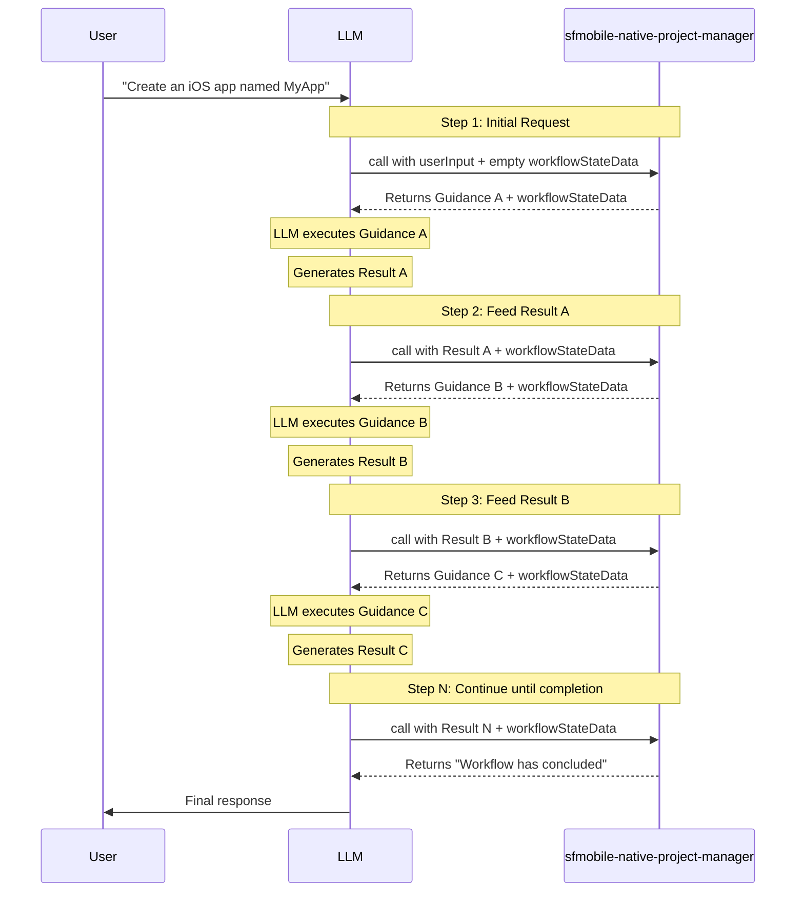

# Requirements Document for MCP Orchestrator Tool Testing

## Problem Statement

The existing MCP evaluation framework (documented in [mcp-evaluation-tests-guide.md](./mcp-evaluation-tests-guide.md)) is designed for single-tool evaluations focused on LWC components. The `sfmobile-native-project-manager` tool operates fundamentally differently - it orchestrates multi-step workflows where:

- The tool is invoked **multiple times iteratively** during a single user request
- Each invocation returns **different guidance** that instructs the LLM what to do next
- The LLM must **execute the guidance** and feed the result back as input to the next tool call
- The workflow is **deterministic** for a given prompt and execution path

---

## Sequential Tool Call Pattern

The `sfmobile-native-project-manager` follows a loop pattern where the orchestrator and LLM alternate responsibility:



### Key Observations

1. **Each guidance is unique**: The orchestrator returns different instructions at each step based on internal workflow state
2. **LLM generates results**: The LLM must interpret the guidance, perform the requested task, and produce a structured result
3. **Results feed forward**: Each LLM-generated result becomes the `userInput` for the next orchestrator call
4. **workflowStateData is opaque**: The `thread_id` must be round-tripped unchanged to maintain session continuity
5. **Variable step count**: The number of iterations depends on the workflow path (could be 5-30+ steps)

---

## Requirements for Generalized MCP Testing Framework

### REQ-1: Iterative Tool Invocation Support

**Description**: The framework must support calling the same MCP tool multiple times in sequence, where each invocation returns guidance that the LLM must execute, and the LLM's output feeds into the next invocation.

**Input/Output Pattern**:

| Step | Input to Orchestrator | Output from Orchestrator |
|------|----------------------|-------------------------|
| 1 | `{ userInput: { request: "user prompt" }, workflowStateData: { thread_id: "" } }` | `{ orchestrationInstructionsPrompt: "Guidance A...", workflowStateData: { thread_id: "abc123" } }` |
| 2 | `{ userInput: <LLM result from Guidance A>, workflowStateData: { thread_id: "abc123" } }` | `{ orchestrationInstructionsPrompt: "Guidance B...", workflowStateData: { thread_id: "abc123" } }` |
| 3 | `{ userInput: <LLM result from Guidance B>, workflowStateData: { thread_id: "abc123" } }` | `{ orchestrationInstructionsPrompt: "Guidance C...", workflowStateData: { thread_id: "abc123" } }` |
| ... | ... | ... |
| N | `{ userInput: <LLM result from Guidance N-1>, workflowStateData: { thread_id: "abc123" } }` | `{ orchestrationInstructionsPrompt: "The workflow has concluded..." }` |

**Key requirement**: The testing framework must:

- Capture the orchestrator's guidance output
- Allow the LLM to process that guidance and generate a result
- Feed the LLM's result back as the next `userInput`
- Continue this loop until termination

### REQ-2: Input/Output Capture Per Step

**Description**: The framework must capture and track input and output for each orchestration step for debugging and evaluation purposes.

**Capture data structure per step**:

```typescript
interface StepCapture {
  stepNumber: number;
  input: {
    userInput: unknown;           // What the LLM fed into this step
    workflowStateData: {
      thread_id: string;
    };
  };
  output: {
    orchestrationInstructionsPrompt: string;  // The guidance returned
  };
  llmGeneratedResult?: unknown;   // What the LLM produced after processing guidance
  timestamp: Date;
}
```

**Use cases**:

- Debugging: Trace why a workflow failed at a specific step
- Evaluation: Score LLM compliance with guidance instructions

### REQ-3: Termination Condition Configuration

**Description**: The framework must allow defining termination conditions to prevent infinite execution loops. Without explicit limits, an orchestrator test could run indefinitely.

**Required termination options**:

1. **Max tool invocations**: Stop after N calls to the orchestrator (configurable, e.g., 50)
2. **Completion detection**: Recognize workflow completion via the message: `"The workflow has concluded. No further workflow actions are forthcoming.", which is part of the output guidance.
3. **Failure detection**: Recognize failure patterns in the guidance output
4. **Timeout**: Maximum wall-clock time for the entire test (e.g., 10 minutes)

**Configuration example**:

```typescript
interface TerminationConfig {
  maxToolInvocations: number;      // e.g., 50 - hard stop after N iterations
  completionPattern: RegExp;       // e.g., /workflow has concluded/i
  failurePatterns: RegExp[];       // Patterns indicating workflow failure
  timeoutMs: number;               // e.g., 600000 (10 min)
}
```

**Termination behavior**:

- When `maxToolInvocations` is reached: Stop and mark test as "terminated by limit"
- When `completionPattern` matches: Stop and mark test as "completed successfully"
- When any `failurePatterns` match: Stop and mark test as "failed"
- When `timeoutMs` exceeded: Stop and mark test as "timed out"

---

## Proposed Test Structure

```typescript
// Example: sfmobileNativeProjectManager.eval.ts

/**
 * Captures input/output for each orchestration step.
 * Essential for tracking the full execution trace.
 */
interface StepCapture {
  stepNumber: number;
  input: {
    userInput: unknown;           // What the LLM fed into this step
    workflowStateData: {
      thread_id: string;
    };
  };
  output: {
    orchestrationInstructionsPrompt: string;  // The guidance returned
  };
  llmGeneratedResult?: unknown;   // What the LLM produced after processing guidance
  timestamp: Date;
}

/**
 * The complete execution trace returned by the test runner.
 */
interface ExecutionTrace {
  steps: StepCapture[];           // All captured steps in order
  outcome: 'completion' | 'failure' | 'terminated' | 'timeout';
  totalDurationMs: number;
}

/**
 * Configuration for orchestrator evaluation tests.
 */
interface OrchestratorEvalConfig {
  prompt: string;                  // Initial user request
  termination: TerminationConfig;  // When to stop
  assertions: {
    minSteps?: number;             // Minimum expected iterations
    maxSteps?: number;             // Maximum expected iterations
    expectedOutcome: 'completion' | 'failure' | 'terminated';
  };
}

describe('sfmobile-native-project-manager Orchestration Evaluation', () => {
  test.each(SCENARIOS)(
    'evaluates $scenario',
    async ({ config }) => {
      const runner = new OrchestratorTestRunner({
        toolName: 'sfmobile-native-project-manager',
        termination: config.termination,
      });
      
      const trace: ExecutionTrace = await runner.execute(config.prompt);
      
      // Log full trace to LangSmith for analysis and debugging
      logOutputs({
        steps: trace.steps,
        outcome: trace.outcome,
        totalInvocations: trace.steps.length,
        totalDurationMs: trace.totalDurationMs,
      });

      // Score the orchestration execution
      const wrappedScoreFn = wrapEvaluator(scoreOrchestratorExecution);
      await wrappedScoreFn({
        trace,
        config,
      });
    }
  );
});

/**
 * Pseudo score function for orchestrator evaluation.
 * Evaluates the execution trace against expected criteria.
 */
function scoreOrchestratorExecution({
  trace,
  config,
}: {
  trace: ExecutionTrace;
  config: OrchestratorEvalConfig;
}): EvaluationResult {
  const scores: Record<string, number> = {};

  // Score 1: Outcome correctness
  scores.outcomeCorrectness = trace.outcome === config.assertions.expectedOutcome ? 1.0 : 0.0;

  // Score 2: Step count within expected range
  const { minSteps, maxSteps } = config.assertions;
  const stepCount = trace.steps.length;
  if (minSteps && maxSteps) {
    scores.stepCountAccuracy =
      stepCount >= minSteps && stepCount <= maxSteps ? 1.0 : 0.0;
  }

  // Score 3: LLM compliance - did LLM generate valid results for each guidance?
  const validResults = trace.steps.filter((step) => step.llmGeneratedResult !== undefined);
  scores.llmComplianceRate = validResults.length / trace.steps.length;

  // Score 4: Workflow continuity - was thread_id preserved across all steps?
  const threadIds = trace.steps.map((step) => step.input.workflowStateData.thread_id);
  const uniqueThreadIds = new Set(threadIds.filter((id) => id !== ''));
  scores.workflowContinuity = uniqueThreadIds.size <= 1 ? 1.0 : 0.0;

  return {
    scores,
    overallScore: Object.values(scores).reduce((a, b) => a + b, 0) / Object.keys(scores).length,
  };
}
```

---

## Key Differences from LWC Single-Tool Evaluations

| Aspect | LWC Evaluation | Orchestrator Evaluation |
|--------|----------------|------------------------|
| Tool calls | Single | Multiple (iterative loop) |
| Output type | Modified code | Guidance instructions for LLM |
| LLM role | Apply tool guidance to fix code | Execute guidance and generate structured results |
| Input for next step | N/A (single call) | LLM-generated result from previous guidance |
| Termination | Tool returns result | Explicit completion message or invocation limit |
| Expected iterations | 1 | 5-30+ depending on workflow |
| Timeout | 5 minutes | 10+ minutes |

---

## Example Guidance Output

Each orchestrator invocation returns an `orchestrationInstructionsPrompt` containing guidance for the LLM. Example:

```
# Your Task

Extract the following information from the user's request:
- Platform (iOS or Android)
- Project name
- Package identifier

Return your result as a JSON object with these fields...

# After completing this task

Call the sfmobile-native-project-manager tool with your result as the userInput parameter
and include workflowStateData: { "thread_id": "mmw-1234567890-abc123" }
```

The LLM must:

1. Parse and understand the guidance
2. Execute the requested task
3. Format the result according to the specified schema
4. Call the orchestrator again with the result

This loop continues until the orchestrator returns a completion message.
