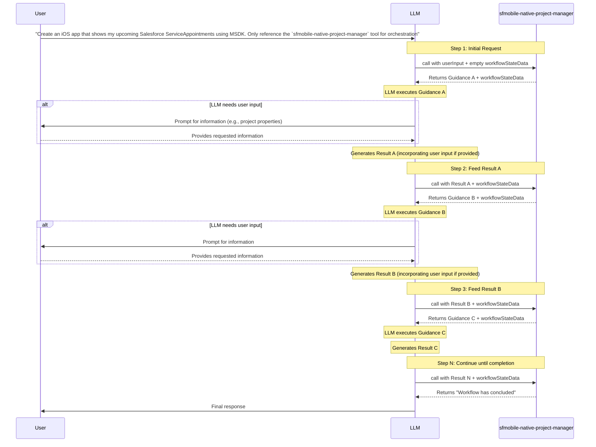

# Requirements Document for MCP Orchestrator Tool Testing

## Problem Statement

The existing MCP evaluation framework (documented in [mcp-evaluation-tests-guide.md](./mcp-evaluation-tests-guide.md)) is designed for single-tool evaluations focused on LWC components. The `sfmobile-native-project-manager` tool operates fundamentally differently - it orchestrates multi-step workflows where:

- The tool is invoked **multiple times iteratively** during a single user request
- Each invocation returns **different guidance** that instructs the LLM what to do next
- The LLM must **execute the guidance** and feed the result back as input to the next tool call
- The workflow is **deterministic** for a given prompt and execution path

---

## Sequential Tool Call Pattern

The `sfmobile-native-project-manager` follows a loop pattern where the orchestrator and LLM alternate responsibility:



### Key Observations

1. **Each guidance is unique**: The orchestrator returns different instructions at each step based on internal workflow state
2. **LLM generates results**: The LLM must interpret the guidance, perform the requested task, and produce a structured result
3. **LLM may request user input**: During guidance execution, the LLM may need to ask the user for information (e.g., project properties, configuration values) before generating the result
4. **Results feed forward**: Each LLM-generated result becomes the `userInput` for the next orchestrator call
5. **workflowStateData is opaque**: The `thread_id` must be round-tripped unchanged to maintain session continuity
6. **Variable step count**: The number of iterations depends on the workflow path (could be 5-30+ steps)

---

## Requirements for Generalized MCP Testing Framework

### REQ-1: Iterative Tool Invocation Support

**Description**: The framework must support calling the same MCP tool multiple times in sequence, where each invocation returns guidance that the LLM must execute. During guidance execution, the LLM may prompt the user for input (which is handled via preconfigured responses in tests), and the LLM's output feeds into the next invocation.

**Input/Output Pattern**:

| Step | Input to Orchestrator | Output from Orchestrator | LLM Action |
|------|----------------------|-------------------------|--------------------|
| 1 | `{ userInput: { request: "user prompt" }, workflowStateData: { thread_id: "" } }` | `{ orchestrationInstructionsPrompt: "Guidance A...", workflowStateData: { thread_id: "abc123" } }` | Executes Guidance A |
| 1a | - | - | *May prompt user for input (e.g., project name)* |
| 1b | - | - | *Generates Result A (incorporating user input if provided)* |
| 2 | `{ userInput: <LLM result from Guidance A>, workflowStateData: { thread_id: "abc123" } }` | `{ orchestrationInstructionsPrompt: "Guidance B...", workflowStateData: { thread_id: "abc123" } }` | Executes Guidance B |
| 2a | - | - | *May prompt user for input* |
| 2b | - | - | *Generates Result B (incorporating user input if provided)* |
| 3 | `{ userInput: <LLM result from Guidance B>, workflowStateData: { thread_id: "abc123" } }` | `{ orchestrationInstructionsPrompt: "Guidance C...", workflowStateData: { thread_id: "abc123" } }` | Executes Guidance C, generates Result C |
| ... | ... | ... | ... |
| N | `{ userInput: <LLM result from Guidance N-1>, workflowStateData: { thread_id: "abc123" } }` | `{ orchestrationInstructionsPrompt: "The workflow has concluded..." }` | Workflow complete |

**Key requirement**: The testing framework must:

- Capture the orchestrator's guidance output
- Allow the LLM to process that guidance and generate a result
- Handle user interaction requests from the LLM during guidance execution
- Provide preconfigured responses when the LLM prompts for user input (in automated tests)
- Feed the LLM's result back as the next `userInput`
- Continue this loop until termination

### REQ-2: Input/Output Capture Per Step

**Description**: The framework must capture and track input and output for each orchestration step for debugging and evaluation purposes.

**Capture data structure per step**:

```typescript
interface StepCapture {
  stepNumber: number;
  input: {
    userInput: unknown;           // What the LLM fed into this step
    workflowStateData: {
      thread_id: string;
    };
  };
  output: {
    orchestrationInstructionsPrompt: string;  // The guidance returned
  };
  userInteraction?: {             // NEW: Track if LLM requested user input
    promptToUser: string;         // What the LLM asked
    userResponse: unknown;        // What was provided (from preconfigured inputs)
    wasConfigured: boolean;       // Whether this came from preconfigured inputs
  };
  llmGeneratedResult?: unknown;   // What the LLM produced after processing guidance
  timestamp: Date;
}
```

**Use cases**:

- Debugging: Trace why a workflow failed at a specific step
- Evaluation: Score LLM compliance with guidance instructions

### REQ-3: Termination Condition Configuration

**Description**: The framework must allow defining termination conditions to prevent infinite execution loops. Without explicit limits, an orchestrator test could run indefinitely.

**Required termination options**:

1. **Max tool invocations**: Stop after N calls to the orchestrator (configurable, e.g., 50)
2. **Completion detection**: Recognize workflow completion via the message: `"The workflow has concluded. No further workflow actions are forthcoming.", which is part of the output guidance.
3. **Failure detection**: Recognize failure patterns in the guidance output
4. **Timeout**: Maximum wall-clock time for the entire test (e.g., 10 minutes)

**Configuration example**:

```typescript
interface TerminationConfig {
  maxToolInvocations: number;      // e.g., 50 - hard stop after N iterations
  completionPattern: RegExp;       // e.g., /workflow has concluded/i
  failurePatterns: RegExp[];       // Patterns indicating workflow failure
  timeoutMs: number;               // e.g., 600000 (10 min)
}
```

**Termination behavior**:

- When `maxToolInvocations` is reached: Stop and mark test as "terminated by limit"
- When `completionPattern` matches: Stop and mark test as "completed successfully"
- When any `failurePatterns` match: Stop and mark test as "failed"
- When `timeoutMs` exceeded: Stop and mark test as "timed out"

### REQ-4: Preconfigured User Input Support

**Description**: The framework must support providing preconfigured user responses for testing scenarios where the LLM would normally prompt the user for input during guidance execution.

**Rationale**:

- Orchestration workflows may require user input (project name, configuration values, etc.)
- Automated tests cannot rely on interactive user prompts
- Tests must be deterministic and repeatable

**Configuration structure**:

```typescript
interface PreconfiguredInput {
  // Pattern to match in the guidance or LLM prompt
  triggerPattern: RegExp | string;

  // The response to provide when this pattern is detected
  response: unknown;

  // Optional: specific step number (if null, applies to any step)
  stepNumber?: number;
}

interface TestConfig {
  prompt: string;
  preconfiguredInputs: PreconfiguredInput[];
  termination: TerminationConfig;
}
```

**Matching behavior**:

- When the LLM's guidance execution would prompt for user input, check preconfigured inputs
- Match based on `triggerPattern` against the guidance text or LLM's internal prompt
- If `stepNumber` is specified, only apply at that specific step
- Return the configured `response` as if the user provided it
- If no match found, the test should fail with a clear error indicating missing preconfigured input

---

## Proposed Test Structure

```typescript
// Example: sfmobileNativeProjectManager.eval.ts

/**
 * Captures input/output for each orchestration step.
 * Essential for tracking the full execution trace.
 */
interface StepCapture {
  stepNumber: number;
  input: {
    userInput: unknown;           // What the LLM fed into this step
    workflowStateData: {
      thread_id: string;
    };
  };
  output: {
    orchestrationInstructionsPrompt: string;  // The guidance returned
  };
  userInteraction?: {             // Track if LLM requested user input
    promptToUser: string;         // What the LLM asked
    userResponse: unknown;        // What was provided (from preconfigured inputs)
    wasConfigured: boolean;       // Whether this came from preconfigured inputs
  };
  llmGeneratedResult?: unknown;   // What the LLM produced after processing guidance
  timestamp: Date;
}

/**
 * The complete execution trace returned by the test runner.
 */
interface ExecutionTrace {
  steps: StepCapture[];           // All captured steps in order
  outcome: 'completion' | 'failure' | 'terminated' | 'timeout';
  totalDurationMs: number;
  totalUserInteractions: number;  // Count of steps requiring user input
}

/**
 * Configuration for orchestrator evaluation tests.
 */
interface OrchestratorEvalConfig {
  prompt: string;                        // Initial user request
  preconfiguredInputs: PreconfiguredInput[];  // Preconfigured user responses for testing
  termination: TerminationConfig;        // When to stop
  assertions: {
    minSteps?: number;                   // Minimum expected iterations
    maxSteps?: number;                   // Maximum expected iterations
    expectedOutcome: 'completion' | 'failure' | 'terminated';
    expectedUserInteractions?: number;   // Expected number of user prompts
  };
}

// Example test scenarios with preconfigured user inputs
const SCENARIOS = [
  {
    scenario: 'Create iOS project with user-provided properties',
    config: {
      prompt: 'Create an iOS app that shows my upcoming Salesforce ServiceAppointments using MSDK. Only reference the `sfmobile-native-project-manager` tool for orchestration',
      preconfiguredInputs: [
        {
          triggerPattern: /app name|project name/i,
          response: 'SalesTracker',
        },
        {
          triggerPattern: /package name/i,
          response: 'com.salesforce.salestracker',
        },
        {
          triggerPattern: /organization/i,
          response: 'Salesforce',
        },
      ],
      termination: {
        maxToolInvocations: 50,
        completionPattern: /workflow has concluded/i,
        failurePatterns: [],
        timeoutMs: 600000,
      },
      assertions: {
        expectedOutcome: 'completion',
        expectedUserInteractions: 3,
      },
    },
  },
];

describe('sfmobile-native-project-manager Orchestration Evaluation', () => {
  test.each(SCENARIOS)(
    'evaluates $scenario',
    async ({ config }) => {
      const runner = new OrchestratorTestRunner({
        toolName: 'sfmobile-native-project-manager',
        preconfiguredInputs: config.preconfiguredInputs,
        termination: config.termination,
      });

      const trace: ExecutionTrace = await runner.execute(config.prompt);

      // Log full trace to LangSmith for analysis and debugging
      logOutputs({
        steps: trace.steps,
        outcome: trace.outcome,
        totalInvocations: trace.steps.length,
        totalDurationMs: trace.totalDurationMs,
        totalUserInteractions: trace.totalUserInteractions,
      });

      // Score the orchestration execution
      const wrappedScoreFn = wrapEvaluator(scoreOrchestratorExecution);
      await wrappedScoreFn({
        trace,
        config,
      });
    }
  );
});

/**
 * Pseudo score function for orchestrator evaluation.
 * Evaluates the execution trace against expected criteria.
 */
function scoreOrchestratorExecution({
  trace,
  config,
}: {
  trace: ExecutionTrace;
  config: OrchestratorEvalConfig;
}): EvaluationResult {
  const scores: Record<string, number> = {};

  // Score 1: Outcome correctness
  scores.outcomeCorrectness = trace.outcome === config.assertions.expectedOutcome ? 1.0 : 0.0;

  // Score 2: Step count within expected range
  const { minSteps, maxSteps } = config.assertions;
  const stepCount = trace.steps.length;
  if (minSteps && maxSteps) {
    scores.stepCountAccuracy =
      stepCount >= minSteps && stepCount <= maxSteps ? 1.0 : 0.0;
  }

  // Score 3: LLM compliance - did LLM generate valid results for each guidance?
  const validResults = trace.steps.filter((step) => step.llmGeneratedResult !== undefined);
  scores.llmComplianceRate = validResults.length / trace.steps.length;

  // Score 4: Workflow continuity - was thread_id preserved across all steps?
  const threadIds = trace.steps.map((step) => step.input.workflowStateData.thread_id);
  const uniqueThreadIds = new Set(threadIds.filter((id) => id !== ''));
  scores.workflowContinuity = uniqueThreadIds.size <= 1 ? 1.0 : 0.0;

  // Score 5: User interaction handling - did LLM handle user prompts correctly?
  const { expectedUserInteractions } = config.assertions;
  if (expectedUserInteractions !== undefined) {
    const actualInteractions = trace.steps.filter(
      (step) => step.userInteraction !== undefined
    ).length;
    scores.userInteractionAccuracy =
      actualInteractions === expectedUserInteractions ? 1.0 : 0.0;
  }

  return {
    scores,
    overallScore: Object.values(scores).reduce((a, b) => a + b, 0) / Object.keys(scores).length,
  };
}
```

---

## Key Differences from LWC Single-Tool Evaluations

| Aspect | LWC Evaluation | Orchestrator Evaluation |
|--------|----------------|------------------------|
| Tool calls | Single | Multiple (iterative loop) |
| Output type | Modified code | Guidance instructions for LLM |
| LLM role | Apply tool guidance to fix code | Execute guidance and generate structured results |
| User interaction | None | LLM may prompt user (with preconfigured responses in tests) |
| Input for next step | N/A (single call) | LLM-generated result from previous guidance |
| Termination | Tool returns result | Explicit completion message or invocation limit |
| Expected iterations | 1 | 5-30+ depending on workflow |
| Timeout | 5 minutes | 10+ minutes |

---

## Example Guidance Output

Each orchestrator invocation returns an `orchestrationInstructionsPrompt` containing guidance for the LLM. Example:

```
# Your Task

Extract the following information from the user's request:
- Platform (iOS or Android)
- App name
- Package name
- Organization name

Return your result as a JSON object with these fields...

# After completing this task

Call the sfmobile-native-project-manager tool with your result as the userInput parameter
and include workflowStateData: { "thread_id": "mmw-1234567890-abc123" }
```

The LLM must:

1. Parse and understand the guidance
2. Execute the requested task
3. Format the result according to the specified schema
4. Call the orchestrator again with the result

This loop continues until the orchestrator returns a completion message.

---

## Example: Workflow with User Interaction

This section demonstrates how user interaction works during orchestration, and how preconfigured inputs enable automated testing.

### Step 1: Orchestrator returns guidance

```json
{
  "orchestrationInstructionsPrompt": "Ask the user for the app name, package name, and organization name. Return a JSON object with these fields: { \"appName\": string, \"packageName\": string, \"organization\": string }",
  "workflowStateData": { "thread_id": "abc123" }
}
```

### Step 2: LLM processes guidance and realizes it needs user input

The LLM interprets the guidance and determines it needs to ask the user for information.

**In a real conversation**, the LLM would prompt:
- "What should the app name be?"
- "What should the package name be?"
- "What is the organization name?"

**In automated testing**, the framework matches against `preconfiguredInputs`:

```typescript
// Configured inputs for this test
preconfiguredInputs: [
  {
    triggerPattern: /app name|project name/i,
    response: 'SalesTracker'
  },
  {
    triggerPattern: /package name/i,
    response: 'com.salesforce.salestracker'
  },
  {
    triggerPattern: /organization/i,
    response: 'Salesforce'
  }
]
```

- LLM's internal prompt about "app name" matches pattern `/app name|project name/i`
- Framework returns: `"SalesTracker"`
- LLM's internal prompt about "package name" matches pattern `/package name/i`
- Framework returns: `"com.salesforce.salestracker"`
- LLM's internal prompt about "organization" matches pattern `/organization/i`
- Framework returns: `"Salesforce"`

### Step 3: LLM generates result with user-provided data

```json
{
  "appName": "SalesTracker",
  "packageName": "com.salesforce.salestracker",
  "organization": "Salesforce"
}
```

This step is captured in `StepCapture`:

```typescript
{
  stepNumber: 1,
  input: {
    userInput: { request: "Create an iOS app that shows my upcoming Salesforce ServiceAppointments using MSDK. Only reference the `sfmobile-native-project-manager` tool for orchestration" },
    workflowStateData: { thread_id: "abc123" }
  },
  output: {
    orchestrationInstructionsPrompt: "Ask the user for the app name, package name, and organization name..."
  },
  userInteraction: {
    promptToUser: "What should the app name be? What should the package name be? What is the organization name?",
    userResponse: {
      appName: "SalesTracker",
      packageName: "com.salesforce.salestracker",
      organization: "Salesforce"
    },
    wasConfigured: true
  },
  llmGeneratedResult: {
    appName: "SalesTracker",
    packageName: "com.salesforce.salestracker",
    organization: "Salesforce"
  },
  timestamp: new Date()
}
```

### Step 4: Result feeds to next orchestrator call

The LLM calls the orchestrator with the generated result, continuing the workflow:

```typescript
// Next tool call
{
  userInput: {
    appName: "SalesTracker",
    packageName: "com.salesforce.salestracker",
    organization: "Salesforce"
  },
  workflowStateData: { thread_id: "abc123" }
}
```

The orchestrator receives this input and returns the next guidance, and the loop continues until completion.

---

## Example: Step Without User Interaction (Template Selection)

Not all orchestration steps require user interaction. This example shows a step where the LLM processes guidance, makes a decision based on the provided data, and generates a result without prompting the user.

### Scenario: Template Selection

After collecting the project properties (app name, package name, organization), the orchestrator asks the LLM to select the most appropriate project template based on the user's original intent.

### Step 1: Orchestrator provides guidance with template list

```json
{
  "orchestrationInstructionsPrompt": "Based on the user's original request to 'Create an iOS app that shows my upcoming Salesforce ServiceAppointments using MSDK', select the most appropriate template from the following list:\n\n1. **Basic iOS App** - Empty project with minimal setup\n2. **iOS App with Navigation** - Project with UINavigationController setup\n3. **iOS App with Tab Bar** - Project with UITabBarController setup\n4. **iOS App with SwiftUI** - Modern SwiftUI-based project\n5. **iOS App with MSDK Integration** - Project pre-configured with Salesforce Mobile SDK\n\nReturn a JSON object with: { \"selectedTemplate\": string (template name), \"reason\": string (why this template fits) }",
  "workflowStateData": { "thread_id": "abc123" }
}
```

### Step 2: LLM processes guidance and selects template

The LLM analyzes the user's original request and the available templates. Since the user specifically requested an app that "shows my upcoming Salesforce ServiceAppointments using MSDK", the LLM selects the MSDK-integrated template.

**No user interaction is needed** - the LLM has all the information required to make the decision.

### Step 3: LLM generates result

```json
{
  "selectedTemplate": "iOS App with MSDK Integration",
  "reason": "User specifically requested an app that shows Salesforce ServiceAppointments using MSDK, so the iOS App with MSDK Integration template is most appropriate as it comes pre-configured with Salesforce Mobile SDK."
}
```

### Step 4: Captured in StepCapture (without userInteraction field)

```typescript
{
  stepNumber: 2,
  input: {
    userInput: {
      appName: "SalesTracker",
      packageName: "com.salesforce.salestracker",
      organization: "Salesforce"
    },
    workflowStateData: { thread_id: "abc123" }
  },
  output: {
    orchestrationInstructionsPrompt: "Based on the user's original request to 'Create an iOS app that shows my upcoming Salesforce ServiceAppointments using MSDK', select the most appropriate template..."
  },
  // No userInteraction field - LLM made decision without prompting user
  llmGeneratedResult: {
    selectedTemplate: "iOS App with MSDK Integration",
    reason: "User specifically requested an app that shows Salesforce ServiceAppointments using MSDK, so the iOS App with MSDK Integration template is most appropriate as it comes pre-configured with Salesforce Mobile SDK."
  },
  timestamp: new Date()
}
```

### Key Differences from Steps with User Interaction

| Aspect | With User Interaction | Without User Interaction |
|--------|----------------------|--------------------------|
| **userInteraction field** | Present, contains promptToUser, userResponse, wasConfigured | Absent (undefined) |
| **LLM behavior** | Pauses execution to request user input | Continues execution using provided data |
| **Decision-making** | User provides missing information | LLM makes decision based on available context |
| **Test configuration** | Requires preconfiguredInputs | No preconfiguredInputs needed for this step |
| **Example use cases** | Collecting app name, package name, organization | Template selection, configuration analysis, code generation |

### Real-World Workflow: Mixed Steps

A typical orchestration workflow includes both types of steps:

1. **Step 1** (with user interaction): Collect app name, package name, organization
2. **Step 2** (no user interaction): Select appropriate template from list
3. **Step 3** (no user interaction): Generate project structure based on template
4. **Step 4** (with user interaction): Ask user for additional feature configurations
5. **Step 5** (no user interaction): Generate final project files

The `ExecutionTrace.totalUserInteractions` field counts only steps where `userInteraction` is present, allowing tests to verify the expected number of user prompts.
